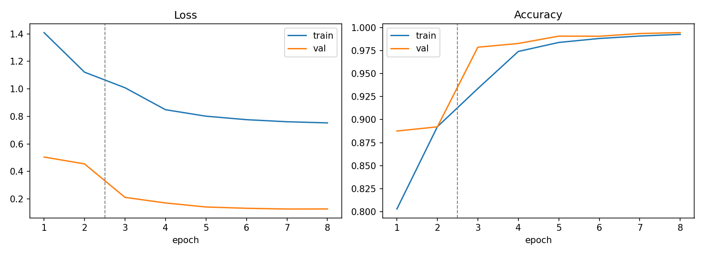
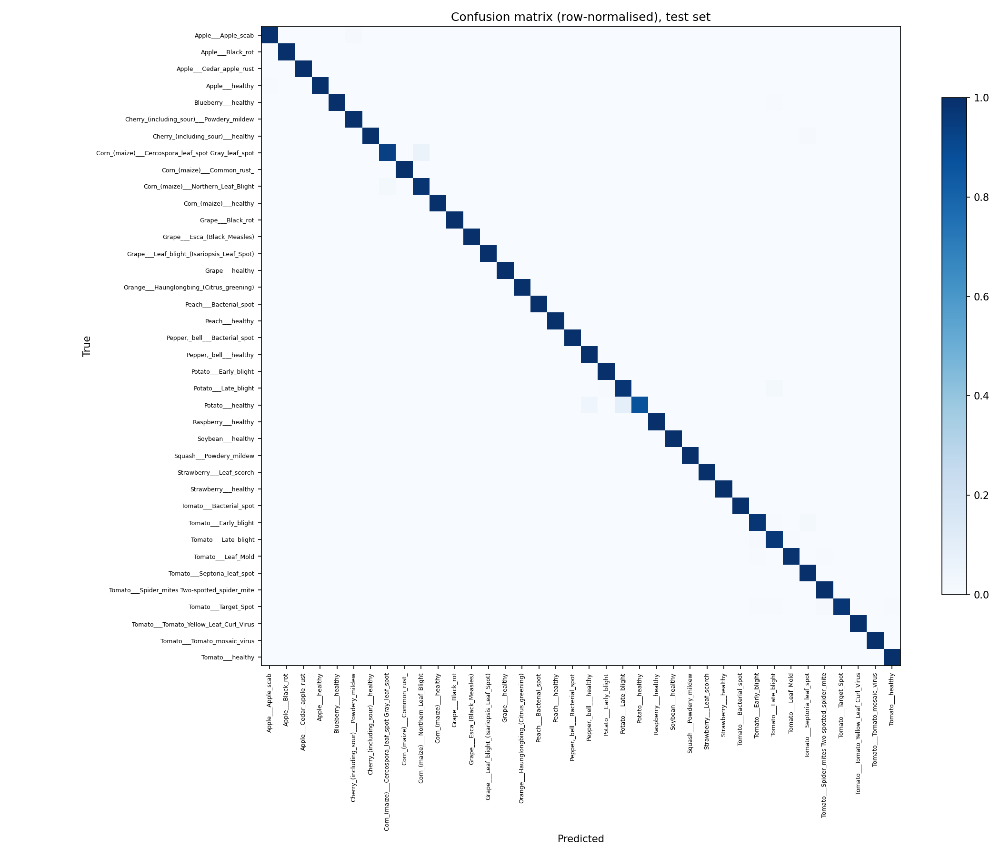

# Model evaluation

Model version: `mnv2-plantvillage-v1` (MobileNetV2, transfer learning, exported to ONNX).
Notebook: `ml/train.ipynb` (run on a Kaggle GPU). Raw outputs: `ml/evaluation/`.

## Summary

| Measure (held-out test set, 8,146 images, 38 classes) | Value |
|---|---|
| Accuracy | 99.48% (42 wrong out of 8,146) |
| Top-3 accuracy (true class among the 3 best guesses) | 99.96% |
| Macro F1 | 0.9918 |
| Macro precision | 0.9936 |
| Macro recall | 0.9902 |
| Weighted F1 | 0.9948 |

16 of 38 classes have an F1 of exactly 1.0000, and 29 of 38 are at 0.99 or above.

**Read these numbers carefully.** They measure accuracy on held-out *PlantVillage* images, which are
lab-style photos (single leaf, plain background, even light). They are **not** an estimate of accuracy
on real phone photos, which is expected to be lower. See "What these numbers do not tell you" below.

## How the model was built

- **Base model:** MobileNetV2 with ImageNet weights. The final layer was replaced with a new head
  (dropout 0.2, then a linear layer with 38 outputs).
- **Training, in two phases:**
  1. Head only, 2 epochs: the pretrained backbone is frozen and only the new head trains (Adam, learning rate 1e-3).
  2. Fine-tune, 6 epochs: the whole network trains at a 10x lower learning rate (AdamW, 1e-4, cosine schedule).
- **Loss and regularisation:** cross-entropy with label smoothing 0.1 on the training set.
- **Augmentation (training only):** random resized crop, horizontal and vertical flips, rotation up to 25 degrees,
  and colour jitter. This is a cheap attempt to narrow the gap between lab photos and phone photos.
- **Input:** resized straight to 224x224, scaled to 0-1, normalised with ImageNet mean and standard deviation.
  The backend uses the same recipe (`ml/export/preprocessing.json`).
- **Checkpoint choice:** the epoch with the best *validation* accuracy was kept. The test set was not used for any choice.
- **Export:** ONNX with a softmax on the end, so the backend reads probabilities directly. The export was checked
  against the PyTorch model on 300 test images (the notebook stops if the predictions disagree).

## How it was evaluated

- **Data:** the Kaggle PlantVillage dataset (`abdallahalidev/plantvillage-dataset`, the `color` folder):
  54,305 images in 38 classes.
- **Split:** 70% train (38,013 images), 15% validation (8,146), 15% test (8,146), stratified by class.
- **Grouped split to reduce leakage.** PlantVillage contains several photos made from the same original leaf photo.
  A plain random split would put near-duplicates in both train and test and inflate the score. Images were therefore
  grouped by the id in the file name, and whole groups were assigned to one split. This lowers leakage but cannot
  remove it completely: the same physical leaf can still appear under different ids.
- **Test set:** 8,146 images, used once, after training was finished.

## Results

### Training curves

The dashed line marks the switch from head-only training to fine-tuning. The best validation accuracy was 99.44%, reached at epoch 8, the last epoch. It was still creeping up at the end, so a few more epochs might add a little. Validation accuracy is close to training accuracy, so there is no sign of heavy overfitting.
Validation loss is lower than training loss because the training loss includes label smoothing and uses augmented
images, while the validation loss does not.

### Weakest classes

| Class | Precision | Recall | F1 | Test images |
|---|---|---|---|---|
| `Potato___healthy` | 1.0000 | 0.8696 | 0.9302 | 23 |
| `Corn_(maize)___Cercospora_leaf_spot Gray_leaf_spot` | 0.9600 | 0.9351 | 0.9474 | 77 |
| `Tomato___Early_blight` | 0.9669 | 0.9733 | 0.9701 | 150 |
| `Tomato___Late_blight` | 0.9754 | 0.9686 | 0.9720 | 287 |
| `Corn_(maize)___Northern_Leaf_Blight` | 0.9664 | 0.9796 | 0.9730 | 147 |

`Potato___healthy` has the lowest recall (0.8696, which is 3 wrong out of 23 test images). It has few examples, so one
or two mistakes move the number a lot. `Corn_(maize)___Cercospora_leaf_spot Gray_leaf_spot` has 5 wrong out of 77.

### Confusion matrix

The matrix is almost a clean diagonal. The visible off-diagonal cells are:
- Potato healthy confused with Potato late blight and with pepper (bell) healthy.
- Corn Cercospora leaf spot confused with Corn Northern leaf blight.
- A few small mix-ups between tomato blights and spots.

### The 0.60 "not sure" threshold

The app shows "We're not sure" when the top confidence is below a threshold, currently 0.60. This table shows what
different thresholds would do on the **test set** (PlantVillage-style images only):

| Threshold | Images the model is confident about | Accuracy on those images | Wrong answers caught (shown as "not sure") |
|---|---|---|---|
| 0.4 | 99.61% | 99.61% | 10 of 42 (23.8%) |
| 0.5 | 99.14% | 99.69% | 17 of 42 (40.5%) |
| 0.6 (app setting) | 98.04% | 99.87% | 32 of 42 (76.2%) |
| 0.7 | 96.26% | 99.91% | 35 of 42 (83.3%) |
| 0.8 | 91.16% | 99.95% | 38 of 42 (90.5%) |
| 0.9 | 61.29% | 99.96% | 40 of 42 (95.2%) |

At 0.60, about 98% of test images get an answer, those answers are right 99.87% of the time, and the threshold
catches 32 of the 42 mistakes. The other 10 mistakes were made with confidence above 0.60.

Raising the threshold catches more mistakes but also hides more correct answers: at 0.90 the model would answer only
61% of images. Part of that drop is probably the label smoothing used in training (0.1), which keeps the model from
ever reaching very high confidence even when it is right. This is an explanation, not something that was tested.

**This table only describes lab-style photos.** In informal tests during development, real phone photos often scored
only 10-25% confidence (not a measured benchmark, just a handful of photos), so they land under 0.60 and show
"We're not sure" in the app. The likely cause is the gap between lab photos and real photos, not the threshold,
which is doing what the table above describes.

## What these numbers do not tell you

1. **Lab photos versus real photos.** The test set comes from the same collection and style as the training data.
   Real phone photos have clutter, shadows, glare, blur and several leaves. This is the main limitation of the model,
   and the reason the app asks for a clear, close photo of a single leaf. Informally, during development, clean-looking
   phone photos often came back as "not sure". That observation was not measured, so no figure is given for it.
2. **Possible leakage.** Grouping reduces near-duplicate leakage but cannot prove there is none, so the test score
   may still be a little optimistic even for PlantVillage-style images.
3. **Fixed set of 38 classes.** The model only knows the 14 crops in PlantVillage. A leaf from another plant gets
   forced into the nearest known class, or flagged uncertain if its confidence is low.
4. **Uncertainty threshold.** The app marks a scan "not sure" when the top confidence is below 0.60 (project file,
   section 8). The table above shows how that threshold behaves on lab-style images only.
5. **Not professional advice.** The advice text shown in the app is generated by an AI model and is not agronomic advice.

## Per-class results (test set)

| Class | Precision | Recall | F1 | Test images |
|---|---|---|---|---|
| `Apple___Apple_scab` | 0.9894 | 0.9894 | 0.9894 | 94 |
| `Apple___Black_rot` | 1.0000 | 1.0000 | 1.0000 | 93 |
| `Apple___Cedar_apple_rust` | 1.0000 | 1.0000 | 1.0000 | 41 |
| `Apple___healthy` | 1.0000 | 0.9959 | 0.9980 | 246 |
| `Blueberry___healthy` | 1.0000 | 0.9956 | 0.9978 | 226 |
| `Cherry_(including_sour)___Powdery_mildew` | 0.9937 | 1.0000 | 0.9968 | 158 |
| `Cherry_(including_sour)___healthy` | 1.0000 | 0.9922 | 0.9961 | 128 |
| `Corn_(maize)___Cercospora_leaf_spot Gray_leaf_spot` | 0.9600 | 0.9351 | 0.9474 | 77 |
| `Corn_(maize)___Common_rust_` | 1.0000 | 1.0000 | 1.0000 | 179 |
| `Corn_(maize)___Northern_Leaf_Blight` | 0.9664 | 0.9796 | 0.9730 | 147 |
| `Corn_(maize)___healthy` | 0.9943 | 1.0000 | 0.9971 | 174 |
| `Grape___Black_rot` | 1.0000 | 1.0000 | 1.0000 | 177 |
| `Grape___Esca_(Black_Measles)` | 1.0000 | 1.0000 | 1.0000 | 207 |
| `Grape___Leaf_blight_(Isariopsis_Leaf_Spot)` | 1.0000 | 1.0000 | 1.0000 | 162 |
| `Grape___healthy` | 1.0000 | 1.0000 | 1.0000 | 64 |
| `Orange___Haunglongbing_(Citrus_greening)` | 1.0000 | 1.0000 | 1.0000 | 826 |
| `Peach___Bacterial_spot` | 1.0000 | 1.0000 | 1.0000 | 344 |
| `Peach___healthy` | 1.0000 | 1.0000 | 1.0000 | 54 |
| `Pepper,_bell___Bacterial_spot` | 1.0000 | 1.0000 | 1.0000 | 150 |
| `Pepper,_bell___healthy` | 0.9955 | 1.0000 | 0.9978 | 222 |
| `Potato___Early_blight` | 0.9934 | 1.0000 | 0.9967 | 150 |
| `Potato___Late_blight` | 0.9799 | 0.9733 | 0.9766 | 150 |
| `Potato___healthy` | 1.0000 | 0.8696 | 0.9302 | 23 |
| `Raspberry___healthy` | 1.0000 | 1.0000 | 1.0000 | 55 |
| `Soybean___healthy` | 1.0000 | 0.9987 | 0.9993 | 764 |
| `Squash___Powdery_mildew` | 1.0000 | 1.0000 | 1.0000 | 275 |
| `Strawberry___Leaf_scorch` | 1.0000 | 1.0000 | 1.0000 | 167 |
| `Strawberry___healthy` | 1.0000 | 1.0000 | 1.0000 | 68 |
| `Tomato___Bacterial_spot` | 0.9938 | 1.0000 | 0.9969 | 319 |
| `Tomato___Early_blight` | 0.9669 | 0.9733 | 0.9701 | 150 |
| `Tomato___Late_blight` | 0.9754 | 0.9686 | 0.9720 | 287 |
| `Tomato___Leaf_Mold` | 0.9860 | 0.9860 | 0.9860 | 143 |
| `Tomato___Septoria_leaf_spot` | 0.9851 | 0.9962 | 0.9906 | 265 |
| `Tomato___Spider_mites Two-spotted_spider_mite` | 0.9882 | 1.0000 | 0.9941 | 252 |
| `Tomato___Target_Spot` | 1.0000 | 0.9763 | 0.9880 | 211 |
| `Tomato___Tomato_Yellow_Leaf_Curl_Virus` | 0.9988 | 0.9988 | 0.9988 | 803 |
| `Tomato___Tomato_mosaic_virus` | 1.0000 | 1.0000 | 1.0000 | 56 |
| `Tomato___healthy` | 0.9917 | 1.0000 | 0.9958 | 239 |

## Reproducing

1. Open `ml/train.ipynb` in Kaggle with a GPU accelerator and internet on, and add a PlantVillage dataset (38 class folders).
2. Run all cells. Outputs go to `/kaggle/working/export` and `/kaggle/working/evaluation`, plus `phase1_outputs.zip`.
3. Unzip into the repo's `ml/` folder. The seed is fixed (42), but small differences between runs are normal on a GPU.
4. The reported run used torch 2.10.0 and torchvision 0.25.0 (CUDA 12.8).